@import url('https://themes.googleusercontent.com/fonts/css?kit=U\_HdmvgDLxl92Im33obxxI55b3GVhHISOSUe9YJyFq0uJeI45r4ViITyHK4FzNwb');ul.lst-kix\_x2dlkp1hc8of-2{list-style-type:none}.lst-kix\_bvl49u6k1kfm-8>li:before{content:"\\0025a0 "}ul.lst-kix\_x2dlkp1hc8of-1{list-style-type:none}ul.lst-kix\_x2dlkp1hc8of-0{list-style-type:none}ul.lst-kix\_x2dlkp1hc8of-6{list-style-type:none}.lst-kix\_bvl49u6k1kfm-6>li:before{content:"\\0025cf "}ul.lst-kix\_x2dlkp1hc8of-5{list-style-type:none}ul.lst-kix\_x2dlkp1hc8of-4{list-style-type:none}.lst-kix\_bvl49u6k1kfm-7>li:before{content:"\\0025cb "}.lst-kix\_mic4rm51p000-6>li{counter-increment:lst-ctn-kix\_mic4rm51p000-6}ul.lst-kix\_x2dlkp1hc8of-3{list-style-type:none}.lst-kix\_bvl49u6k1kfm-1>li:before{content:"\\0025cb "}ol.lst-kix\_mic4rm51p000-6{list-style-type:none}ol.lst-kix\_mic4rm51p000-5{list-style-type:none}.lst-kix\_gpemyzy3mtcn-1>li:before{content:"\\0025cb "}ol.lst-kix\_mic4rm51p000-4{list-style-type:none}ol.lst-kix\_mic4rm51p000-3{list-style-type:none}.lst-kix\_bvl49u6k1kfm-0>li:before{content:"\\0025cf "}.lst-kix\_gpemyzy3mtcn-0>li:before{content:"\\0025cf "}ol.lst-kix\_mic4rm51p000-8{list-style-type:none}ol.lst-kix\_mic4rm51p000-7{list-style-type:none}.lst-kix\_h8y2nkk2qb8c-7>li:before{content:"\\0025cb "}.lst-kix\_h8y2nkk2qb8c-8>li:before{content:"\\0025a0 "}ol.lst-kix\_7owrud1pxicy-2.start{counter-reset:lst-ctn-kix\_7owrud1pxicy-2 0}ul.lst-kix\_x2dlkp1hc8of-8{list-style-type:none}ul.lst-kix\_x2dlkp1hc8of-7{list-style-type:none}ol.lst-kix\_pnv24mm0t3fr-0.start{counter-reset:lst-ctn-kix\_pnv24mm0t3fr-0 0}ol.lst-kix\_mic4rm51p000-3.start{counter-reset:lst-ctn-kix\_mic4rm51p000-3 0}ol.lst-kix\_59nxl6gx6xal-3.start{counter-reset:lst-ctn-kix\_59nxl6gx6xal-3 0}.lst-kix\_zczm8vjjky5u-7>li:before{content:"\\0025cb "}.lst-kix\_zczm8vjjky5u-6>li:before{content:"\\0025cf "}.lst-kix\_gpemyzy3mtcn-7>li:before{content:"\\0025cb "}.lst-kix\_gpemyzy3mtcn-8>li:before{content:"\\0025a0 "}.lst-kix\_zczm8vjjky5u-4>li:before{content:"\\0025cb "}.lst-kix\_zczm8vjjky5u-3>li:before{content:"\\0025cf "}.lst-kix\_zczm8vjjky5u-5>li:before{content:"\\0025a0 "}ol.lst-kix\_pnv24mm0t3fr-6.start{counter-reset:lst-ctn-kix\_pnv24mm0t3fr-6 0}.lst-kix\_zczm8vjjky5u-0>li:before{content:"\\0025cf "}.lst-kix\_gpemyzy3mtcn-2>li:before{content:"\\0025a0 "}.lst-kix\_zczm8vjjky5u-1>li:before{content:"\\0025cb "}.lst-kix\_zczm8vjjky5u-2>li:before{content:"\\0025a0 "}.lst-kix\_gpemyzy3mtcn-3>li:before{content:"\\0025cf "}.lst-kix\_gpemyzy3mtcn-4>li:before{content:"\\0025cb "}.lst-kix\_7owrud1pxicy-0>li{counter-increment:lst-ctn-kix\_7owrud1pxicy-0}.lst-kix\_gpemyzy3mtcn-5>li:before{content:"\\0025a0 "}.lst-kix\_gpemyzy3mtcn-6>li:before{content:"\\0025cf "}.lst-kix\_59nxl6gx6xal-0>li{counter-increment:lst-ctn-kix\_59nxl6gx6xal-0}ul.lst-kix\_6uuokzqpjfif-4{list-style-type:none}ul.lst-kix\_6uuokzqpjfif-3{list-style-type:none}ul.lst-kix\_6uuokzqpjfif-2{list-style-type:none}ul.lst-kix\_6uuokzqpjfif-1{list-style-type:none}ul.lst-kix\_6uuokzqpjfif-8{list-style-type:none}.lst-kix\_s0ojjhs3ea8p-1>li:before{content:"\\0025cb "}ul.lst-kix\_6uuokzqpjfif-7{list-style-type:none}ul.lst-kix\_6uuokzqpjfif-6{list-style-type:none}.lst-kix\_s0ojjhs3ea8p-0>li:before{content:"\\0025cf "}ul.lst-kix\_6uuokzqpjfif-5{list-style-type:none}.lst-kix\_59nxl6gx6xal-7>li{counter-increment:lst-ctn-kix\_59nxl6gx6xal-7}.lst-kix\_s0ojjhs3ea8p-6>li:before{content:"\\0025cf "}ol.lst-kix\_mic4rm51p000-8.start{counter-reset:lst-ctn-kix\_mic4rm51p000-8 0}ol.lst-kix\_7owrud1pxicy-7.start{counter-reset:lst-ctn-kix\_7owrud1pxicy-7 0}.lst-kix\_benhb6uxikeq-5>li:before{content:"\\0025a0 "}.lst-kix\_benhb6uxikeq-7>li:before{content:"\\0025cb "}.lst-kix\_s0ojjhs3ea8p-7>li:before{content:"\\0025cb "}.lst-kix\_pnv24mm0t3fr-2>li{counter-increment:lst-ctn-kix\_pnv24mm0t3fr-2}.lst-kix\_benhb6uxikeq-4>li:before{content:"\\0025cb "}.lst-kix\_benhb6uxikeq-8>li:before{content:"\\0025a0 "}.lst-kix\_s0ojjhs3ea8p-8>li:before{content:"\\0025a0 "}.lst-kix\_7owrud1pxicy-2>li{counter-increment:lst-ctn-kix\_7owrud1pxicy-2}.lst-kix\_benhb6uxikeq-6>li:before{content:"\\0025cf "}.lst-kix\_lp4e2itk3vu6-8>li:before{content:"\\0025a0 "}.lst-kix\_lp4e2itk3vu6-7>li:before{content:"\\0025cb "}.lst-kix\_lp4e2itk3vu6-6>li:before{content:"\\0025cf "}.lst-kix\_benhb6uxikeq-0>li:before{content:"\\0025cf "}.lst-kix\_lp4e2itk3vu6-4>li:before{content:"\\0025cb "}.lst-kix\_lp4e2itk3vu6-3>li:before{content:"\\0025cf "}.lst-kix\_lp4e2itk3vu6-5>li:before{content:"\\0025a0 "}.lst-kix\_benhb6uxikeq-1>li:before{content:"\\0025cf "}.lst-kix\_benhb6uxikeq-3>li:before{content:"\\0025cf "}.lst-kix\_benhb6uxikeq-2>li:before{content:"\\0025a0 "}ol.lst-kix\_7owrud1pxicy-8.start{counter-reset:lst-ctn-kix\_7owrud1pxicy-8 0}.lst-kix\_lp4e2itk3vu6-0>li:before{content:"\\0025cf "}ol.lst-kix\_7owrud1pxicy-1.start{counter-reset:lst-ctn-kix\_7owrud1pxicy-1 0}.lst-kix\_lp4e2itk3vu6-1>li:before{content:"\\0025cb "}.lst-kix\_s0ojjhs3ea8p-5>li:before{content:"\\0025a0 "}ol.lst-kix\_pnv24mm0t3fr-1.start{counter-reset:lst-ctn-kix\_pnv24mm0t3fr-1 0}.lst-kix\_lp4e2itk3vu6-2>li:before{content:"\\0025a0 "}ol.lst-kix\_pnv24mm0t3fr-7.start{counter-reset:lst-ctn-kix\_pnv24mm0t3fr-7 0}.lst-kix\_s0ojjhs3ea8p-4>li:before{content:"\\0025cb "}ol.lst-kix\_59nxl6gx6xal-4.start{counter-reset:lst-ctn-kix\_59nxl6gx6xal-4 0}.lst-kix\_s0ojjhs3ea8p-3>li:before{content:"\\0025cf "}ul.lst-kix\_6uuokzqpjfif-0{list-style-type:none}.lst-kix\_s0ojjhs3ea8p-2>li:before{content:"\\0025a0 "}.lst-kix\_7owrud1pxicy-0>li:before{content:"" counter(lst-ctn-kix\_7owrud1pxicy-0,decimal) ". "}ul.lst-kix\_h8y2nkk2qb8c-8{list-style-type:none}ol.lst-kix\_pnv24mm0t3fr-8{list-style-type:none}ol.lst-kix\_pnv24mm0t3fr-7{list-style-type:none}ol.lst-kix\_pnv24mm0t3fr-6{list-style-type:none}.lst-kix\_mic4rm51p000-1>li{counter-increment:lst-ctn-kix\_mic4rm51p000-1}.lst-kix\_7owrud1pxicy-8>li:before{content:"" counter(lst-ctn-kix\_7owrud1pxicy-8,lower-roman) ". "}.lst-kix\_59nxl6gx6xal-1>li:before{content:"" counter(lst-ctn-kix\_59nxl6gx6xal-1,lower-latin) ". "}.lst-kix\_59nxl6gx6xal-5>li:before{content:"" counter(lst-ctn-kix\_59nxl6gx6xal-5,lower-roman) ". "}ul.lst-kix\_h8y2nkk2qb8c-7{list-style-type:none}ul.lst-kix\_h8y2nkk2qb8c-6{list-style-type:none}ul.lst-kix\_h8y2nkk2qb8c-5{list-style-type:none}ul.lst-kix\_h8y2nkk2qb8c-4{list-style-type:none}ul.lst-kix\_h8y2nkk2qb8c-3{list-style-type:none}.lst-kix\_x2dlkp1hc8of-5>li:before{content:"\\0025a0 "}ul.lst-kix\_h8y2nkk2qb8c-2{list-style-type:none}.lst-kix\_7owrud1pxicy-5>li{counter-increment:lst-ctn-kix\_7owrud1pxicy-5}ul.lst-kix\_h8y2nkk2qb8c-1{list-style-type:none}.lst-kix\_59nxl6gx6xal-3>li:before{content:"" counter(lst-ctn-kix\_59nxl6gx6xal-3,decimal) ". "}ul.lst-kix\_h8y2nkk2qb8c-0{list-style-type:none}ul.lst-kix\_8g74w9y9icfv-5{list-style-type:none}.lst-kix\_x2dlkp1hc8of-3>li:before{content:"\\0025cf "}.lst-kix\_4zopyz5ofyx0-6>li:before{content:"\\0025cf "}ul.lst-kix\_8g74w9y9icfv-6{list-style-type:none}ul.lst-kix\_8g74w9y9icfv-7{list-style-type:none}ul.lst-kix\_s0ojjhs3ea8p-7{list-style-type:none}.lst-kix\_pnv24mm0t3fr-5>li:before{content:"" counter(lst-ctn-kix\_pnv24mm0t3fr-5,lower-roman) ". "}.lst-kix\_pnv24mm0t3fr-7>li:before{content:"" counter(lst-ctn-kix\_pnv24mm0t3fr-7,lower-latin) ". "}ul.lst-kix\_8g74w9y9icfv-8{list-style-type:none}ul.lst-kix\_s0ojjhs3ea8p-8{list-style-type:none}ul.lst-kix\_8g74w9y9icfv-1{list-style-type:none}ul.lst-kix\_8g74w9y9icfv-2{list-style-type:none}.lst-kix\_mic4rm51p000-2>li{counter-increment:lst-ctn-kix\_mic4rm51p000-2}ul.lst-kix\_8g74w9y9icfv-3{list-style-type:none}ul.lst-kix\_8g74w9y9icfv-4{list-style-type:none}.lst-kix\_y0swytn499st-3>li:before{content:"\\0025cf "}ul.lst-kix\_8g74w9y9icfv-0{list-style-type:none}.lst-kix\_x2dlkp1hc8of-1>li:before{content:"\\0025cb "}.lst-kix\_4zopyz5ofyx0-8>li:before{content:"\\0025a0 "}.lst-kix\_y0swytn499st-5>li:before{content:"\\0025a0 "}ol.lst-kix\_59nxl6gx6xal-5.start{counter-reset:lst-ctn-kix\_59nxl6gx6xal-5 0}.lst-kix\_mic4rm51p000-1>li:before{content:"" counter(lst-ctn-kix\_mic4rm51p000-1,lower-latin) ". "}.lst-kix\_59nxl6gx6xal-7>li:before{content:"" counter(lst-ctn-kix\_59nxl6gx6xal-7,lower-latin) ". "}ol.lst-kix\_pnv24mm0t3fr-2.start{counter-reset:lst-ctn-kix\_pnv24mm0t3fr-2 0}ul.lst-kix\_s0ojjhs3ea8p-1{list-style-type:none}ul.lst-kix\_s0ojjhs3ea8p-2{list-style-type:none}.lst-kix\_pnv24mm0t3fr-1>li:before{content:"" counter(lst-ctn-kix\_pnv24mm0t3fr-1,lower-latin) ". "}.lst-kix\_pnv24mm0t3fr-3>li:before{content:"" counter(lst-ctn-kix\_pnv24mm0t3fr-3,decimal) ". "}ul.lst-kix\_s0ojjhs3ea8p-0{list-style-type:none}.lst-kix\_pnv24mm0t3fr-4>li{counter-increment:lst-ctn-kix\_pnv24mm0t3fr-4}ul.lst-kix\_s0ojjhs3ea8p-5{list-style-type:none}.lst-kix\_y0swytn499st-1>li:before{content:"\\0025cb "}ul.lst-kix\_s0ojjhs3ea8p-6{list-style-type:none}.lst-kix\_59nxl6gx6xal-3>li{counter-increment:lst-ctn-kix\_59nxl6gx6xal-3}ul.lst-kix\_s0ojjhs3ea8p-3{list-style-type:none}ul.lst-kix\_s0ojjhs3ea8p-4{list-style-type:none}ol.lst-kix\_pnv24mm0t3fr-5.start{counter-reset:lst-ctn-kix\_pnv24mm0t3fr-5 0}.lst-kix\_59nxl6gx6xal-2>li{counter-increment:lst-ctn-kix\_59nxl6gx6xal-2}.lst-kix\_y0swytn499st-7>li:before{content:"\\0025cb "}ol.lst-kix\_59nxl6gx6xal-8.start{counter-reset:lst-ctn-kix\_59nxl6gx6xal-8 0}.lst-kix\_mic4rm51p000-3>li:before{content:"" counter(lst-ctn-kix\_mic4rm51p000-3,decimal) ". "}.lst-kix\_mic4rm51p000-7>li:before{content:"" counter(lst-ctn-kix\_mic4rm51p000-7,lower-latin) ". "}ul.lst-kix\_y0swytn499st-8{list-style-type:none}ul.lst-kix\_y0swytn499st-5{list-style-type:none}.lst-kix\_4zopyz5ofyx0-4>li:before{content:"\\0025cb "}.lst-kix\_59nxl6gx6xal-8>li{counter-increment:lst-ctn-kix\_59nxl6gx6xal-8}ul.lst-kix\_y0swytn499st-4{list-style-type:none}.lst-kix\_mic4rm51p000-5>li:before{content:"" counter(lst-ctn-kix\_mic4rm51p000-5,lower-roman) ". "}ul.lst-kix\_y0swytn499st-7{list-style-type:none}.lst-kix\_mic4rm51p000-8>li{counter-increment:lst-ctn-kix\_mic4rm51p000-8}ul.lst-kix\_y0swytn499st-6{list-style-type:none}.lst-kix\_4zopyz5ofyx0-2>li:before{content:"\\0025a0 "}.lst-kix\_h8y2nkk2qb8c-6>li:before{content:"\\0025cf "}.lst-kix\_6uuokzqpjfif-8>li:before{content:"\\0025a0 "}.lst-kix\_4zopyz5ofyx0-0>li:before{content:"\\0025cf "}.lst-kix\_7owrud1pxicy-6>li:before{content:"" counter(lst-ctn-kix\_7owrud1pxicy-6,decimal) ". "}.lst-kix\_pnv24mm0t3fr-3>li{counter-increment:lst-ctn-kix\_pnv24mm0t3fr-3}ol.lst-kix\_pnv24mm0t3fr-1{list-style-type:none}.lst-kix\_7owrud1pxicy-4>li{counter-increment:lst-ctn-kix\_7owrud1pxicy-4}ol.lst-kix\_pnv24mm0t3fr-0{list-style-type:none}.lst-kix\_6uuokzqpjfif-2>li:before{content:"\\0025a0 "}.lst-kix\_6uuokzqpjfif-4>li:before{content:"\\0025cb "}.lst-kix\_h8y2nkk2qb8c-2>li:before{content:"\\0025a0 "}.lst-kix\_h8y2nkk2qb8c-4>li:before{content:"\\0025cb "}.lst-kix\_bvl49u6k1kfm-2>li:before{content:"\\0025a0 "}ol.lst-kix\_pnv24mm0t3fr-5{list-style-type:none}ol.lst-kix\_pnv24mm0t3fr-4{list-style-type:none}.lst-kix\_7owrud1pxicy-4>li:before{content:"" counter(lst-ctn-kix\_7owrud1pxicy-4,lower-latin) ". "}ol.lst-kix\_pnv24mm0t3fr-3{list-style-type:none}ol.lst-kix\_pnv24mm0t3fr-2{list-style-type:none}ol.lst-kix\_59nxl6gx6xal-7.start{counter-reset:lst-ctn-kix\_59nxl6gx6xal-7 0}.lst-kix\_h8y2nkk2qb8c-0>li:before{content:"\\0025cf "}.lst-kix\_6uuokzqpjfif-6>li:before{content:"\\0025cf "}.lst-kix\_bvl49u6k1kfm-4>li:before{content:"\\0025cb "}ol.lst-kix\_pnv24mm0t3fr-4.start{counter-reset:lst-ctn-kix\_pnv24mm0t3fr-4 0}.lst-kix\_7owrud1pxicy-2>li:before{content:"" counter(lst-ctn-kix\_7owrud1pxicy-2,lower-roman) ". "}ol.lst-kix\_59nxl6gx6xal-6.start{counter-reset:lst-ctn-kix\_59nxl6gx6xal-6 0}ol.lst-kix\_mic4rm51p000-0.start{counter-reset:lst-ctn-kix\_mic4rm51p000-0 0}ul.lst-kix\_4zopyz5ofyx0-3{list-style-type:none}ul.lst-kix\_4zopyz5ofyx0-2{list-style-type:none}.lst-kix\_6uuokzqpjfif-0>li:before{content:"\\0025cf "}ul.lst-kix\_4zopyz5ofyx0-1{list-style-type:none}ul.lst-kix\_4zopyz5ofyx0-0{list-style-type:none}.lst-kix\_6uuokzqpjfif-1>li:before{content:"\\0025cb "}.lst-kix\_8g74w9y9icfv-7>li:before{content:"\\0025cb "}.lst-kix\_7owrud1pxicy-1>li{counter-increment:lst-ctn-kix\_7owrud1pxicy-1}.lst-kix\_8g74w9y9icfv-6>li:before{content:"\\0025cf "}ul.lst-kix\_4zopyz5ofyx0-8{list-style-type:none}ul.lst-kix\_4zopyz5ofyx0-7{list-style-type:none}ul.lst-kix\_4zopyz5ofyx0-6{list-style-type:none}.lst-kix\_8g74w9y9icfv-8>li:before{content:"\\0025a0 "}ul.lst-kix\_4zopyz5ofyx0-5{list-style-type:none}ul.lst-kix\_4zopyz5ofyx0-4{list-style-type:none}ol.lst-kix\_pnv24mm0t3fr-3.start{counter-reset:lst-ctn-kix\_pnv24mm0t3fr-3 0}ul.lst-kix\_y0swytn499st-1{list-style-type:none}ul.lst-kix\_y0swytn499st-0{list-style-type:none}ul.lst-kix\_y0swytn499st-3{list-style-type:none}.lst-kix\_mic4rm51p000-5>li{counter-increment:lst-ctn-kix\_mic4rm51p000-5}ul.lst-kix\_y0swytn499st-2{list-style-type:none}.lst-kix\_8g74w9y9icfv-0>li:before{content:"\\0025cf "}ol.lst-kix\_mic4rm51p000-6.start{counter-reset:lst-ctn-kix\_mic4rm51p000-6 0}.lst-kix\_8g74w9y9icfv-5>li:before{content:"\\0025a0 "}ol.lst-kix\_7owrud1pxicy-8{list-style-type:none}.lst-kix\_mic4rm51p000-7>li{counter-increment:lst-ctn-kix\_mic4rm51p000-7}ol.lst-kix\_7owrud1pxicy-7{list-style-type:none}.lst-kix\_8g74w9y9icfv-4>li:before{content:"\\0025cb "}.lst-kix\_8g74w9y9icfv-1>li:before{content:"\\0025cb "}ol.lst-kix\_7owrud1pxicy-2{list-style-type:none}ol.lst-kix\_7owrud1pxicy-1{list-style-type:none}ol.lst-kix\_7owrud1pxicy-0{list-style-type:none}.lst-kix\_8g74w9y9icfv-3>li:before{content:"\\0025cf "}ol.lst-kix\_7owrud1pxicy-6{list-style-type:none}ol.lst-kix\_7owrud1pxicy-5{list-style-type:none}.lst-kix\_8g74w9y9icfv-2>li:before{content:"\\0025a0 "}ol.lst-kix\_7owrud1pxicy-4{list-style-type:none}ol.lst-kix\_7owrud1pxicy-3{list-style-type:none}.lst-kix\_pnv24mm0t3fr-1>li{counter-increment:lst-ctn-kix\_pnv24mm0t3fr-1}.lst-kix\_7owrud1pxicy-3>li{counter-increment:lst-ctn-kix\_7owrud1pxicy-3}ul.lst-kix\_bvl49u6k1kfm-8{list-style-type:none}ul.lst-kix\_bvl49u6k1kfm-7{list-style-type:none}ul.lst-kix\_bvl49u6k1kfm-6{list-style-type:none}ul.lst-kix\_bvl49u6k1kfm-5{list-style-type:none}ul.lst-kix\_bvl49u6k1kfm-4{list-style-type:none}ul.lst-kix\_bvl49u6k1kfm-3{list-style-type:none}ul.lst-kix\_bvl49u6k1kfm-2{list-style-type:none}ul.lst-kix\_bvl49u6k1kfm-1{list-style-type:none}ol.lst-kix\_pnv24mm0t3fr-8.start{counter-reset:lst-ctn-kix\_pnv24mm0t3fr-8 0}ul.lst-kix\_bvl49u6k1kfm-0{list-style-type:none}.lst-kix\_pnv24mm0t3fr-8>li{counter-increment:lst-ctn-kix\_pnv24mm0t3fr-8}ol.lst-kix\_7owrud1pxicy-0.start{counter-reset:lst-ctn-kix\_7owrud1pxicy-0 0}.lst-kix\_59nxl6gx6xal-1>li{counter-increment:lst-ctn-kix\_59nxl6gx6xal-1}.lst-kix\_gss2832ffcm-0>li:before{content:"\\0025cf "}.lst-kix\_gss2832ffcm-1>li:before{content:"\\0025cb "}.lst-kix\_gss2832ffcm-2>li:before{content:"\\0025a0 "}.lst-kix\_gss2832ffcm-4>li:before{content:"\\0025cb "}.lst-kix\_gss2832ffcm-3>li:before{content:"\\0025cf "}.lst-kix\_gss2832ffcm-5>li:before{content:"\\0025a0 "}.lst-kix\_x2dlkp1hc8of-6>li:before{content:"\\0025cf "}ol.lst-kix\_59nxl6gx6xal-5{list-style-type:none}.lst-kix\_x2dlkp1hc8of-7>li:before{content:"\\0025cb "}ol.lst-kix\_59nxl6gx6xal-6{list-style-type:none}ol.lst-kix\_59nxl6gx6xal-7{list-style-type:none}.lst-kix\_gss2832ffcm-7>li:before{content:"\\0025cb "}ol.lst-kix\_59nxl6gx6xal-8{list-style-type:none}ol.lst-kix\_59nxl6gx6xal-1{list-style-type:none}ol.lst-kix\_mic4rm51p000-1.start{counter-reset:lst-ctn-kix\_mic4rm51p000-1 0}.lst-kix\_gss2832ffcm-6>li:before{content:"\\0025cf "}ol.lst-kix\_59nxl6gx6xal-2{list-style-type:none}ol.lst-kix\_59nxl6gx6xal-3{list-style-type:none}.lst-kix\_x2dlkp1hc8of-8>li:before{content:"\\0025a0 "}ol.lst-kix\_59nxl6gx6xal-4{list-style-type:none}ol.lst-kix\_59nxl6gx6xal-0{list-style-type:none}.lst-kix\_mic4rm51p000-3>li{counter-increment:lst-ctn-kix\_mic4rm51p000-3}.lst-kix\_gss2832ffcm-8>li:before{content:"\\0025a0 "}ol.lst-kix\_mic4rm51p000-7.start{counter-reset:lst-ctn-kix\_mic4rm51p000-7 0}.lst-kix\_mic4rm51p000-0>li{counter-increment:lst-ctn-kix\_mic4rm51p000-0}ul.lst-kix\_gpemyzy3mtcn-1{list-style-type:none}ul.lst-kix\_gpemyzy3mtcn-2{list-style-type:none}.lst-kix\_59nxl6gx6xal-0>li:before{content:"" counter(lst-ctn-kix\_59nxl6gx6xal-0,decimal) ". "}ul.lst-kix\_gpemyzy3mtcn-0{list-style-type:none}.lst-kix\_59nxl6gx6xal-4>li{counter-increment:lst-ctn-kix\_59nxl6gx6xal-4}.lst-kix\_7owrud1pxicy-6>li{counter-increment:lst-ctn-kix\_7owrud1pxicy-6}.lst-kix\_59nxl6gx6xal-4>li:before{content:"" counter(lst-ctn-kix\_59nxl6gx6xal-4,lower-latin) ". "}.lst-kix\_59nxl6gx6xal-6>li:before{content:"" counter(lst-ctn-kix\_59nxl6gx6xal-6,decimal) ". "}.lst-kix\_59nxl6gx6xal-5>li{counter-increment:lst-ctn-kix\_59nxl6gx6xal-5}.lst-kix\_pnv24mm0t3fr-5>li{counter-increment:lst-ctn-kix\_pnv24mm0t3fr-5}.lst-kix\_59nxl6gx6xal-2>li:before{content:"" counter(lst-ctn-kix\_59nxl6gx6xal-2,lower-roman) ". "}.lst-kix\_x2dlkp1hc8of-4>li:before{content:"\\0025cb "}ul.lst-kix\_zczm8vjjky5u-6{list-style-type:none}.lst-kix\_pnv24mm0t3fr-6>li:before{content:"" counter(lst-ctn-kix\_pnv24mm0t3fr-6,decimal) ". "}.lst-kix\_59nxl6gx6xal-6>li{counter-increment:lst-ctn-kix\_59nxl6gx6xal-6}ul.lst-kix\_zczm8vjjky5u-5{list-style-type:none}ul.lst-kix\_zczm8vjjky5u-8{list-style-type:none}.lst-kix\_4zopyz5ofyx0-5>li:before{content:"\\0025a0 "}.lst-kix\_4zopyz5ofyx0-7>li:before{content:"\\0025cb "}ul.lst-kix\_zczm8vjjky5u-7{list-style-type:none}ul.lst-kix\_zczm8vjjky5u-2{list-style-type:none}.lst-kix\_pnv24mm0t3fr-4>li:before{content:"" counter(lst-ctn-kix\_pnv24mm0t3fr-4,lower-latin) ". "}.lst-kix\_pnv24mm0t3fr-8>li:before{content:"" counter(lst-ctn-kix\_pnv24mm0t3fr-8,lower-roman) ". "}ul.lst-kix\_zczm8vjjky5u-1{list-style-type:none}ul.lst-kix\_zczm8vjjky5u-4{list-style-type:none}.lst-kix\_7owrud1pxicy-8>li{counter-increment:lst-ctn-kix\_7owrud1pxicy-8}.lst-kix\_x2dlkp1hc8of-2>li:before{content:"\\0025a0 "}ul.lst-kix\_zczm8vjjky5u-3{list-style-type:none}.lst-kix\_mic4rm51p000-2>li:before{content:"" counter(lst-ctn-kix\_mic4rm51p000-2,lower-roman) ". "}ul.lst-kix\_zczm8vjjky5u-0{list-style-type:none}.lst-kix\_59nxl6gx6xal-8>li:before{content:"" counter(lst-ctn-kix\_59nxl6gx6xal-8,lower-roman) ". "}ol.lst-kix\_7owrud1pxicy-3.start{counter-reset:lst-ctn-kix\_7owrud1pxicy-3 0}.lst-kix\_mic4rm51p000-0>li:before{content:"" counter(lst-ctn-kix\_mic4rm51p000-0,decimal) ". "}.lst-kix\_y0swytn499st-4>li:before{content:"\\0025cb "}.lst-kix\_x2dlkp1hc8of-0>li:before{content:"\\0025cf "}.lst-kix\_pnv24mm0t3fr-0>li:before{content:"" counter(lst-ctn-kix\_pnv24mm0t3fr-0,decimal) ". "}ol.lst-kix\_59nxl6gx6xal-2.start{counter-reset:lst-ctn-kix\_59nxl6gx6xal-2 0}ol.lst-kix\_mic4rm51p000-2.start{counter-reset:lst-ctn-kix\_mic4rm51p000-2 0}ul.lst-kix\_gss2832ffcm-4{list-style-type:none}.lst-kix\_pnv24mm0t3fr-2>li:before{content:"" counter(lst-ctn-kix\_pnv24mm0t3fr-2,lower-roman) ". "}.lst-kix\_y0swytn499st-2>li:before{content:"\\0025a0 "}ul.lst-kix\_gss2832ffcm-3{list-style-type:none}ul.lst-kix\_gss2832ffcm-6{list-style-type:none}ul.lst-kix\_gss2832ffcm-5{list-style-type:none}ul.lst-kix\_gss2832ffcm-8{list-style-type:none}.lst-kix\_y0swytn499st-0>li:before{content:"\\0025cf "}ol.lst-kix\_7owrud1pxicy-6.start{counter-reset:lst-ctn-kix\_7owrud1pxicy-6 0}ul.lst-kix\_gss2832ffcm-7{list-style-type:none}.lst-kix\_pnv24mm0t3fr-7>li{counter-increment:lst-ctn-kix\_pnv24mm0t3fr-7}ol.lst-kix\_mic4rm51p000-5.start{counter-reset:lst-ctn-kix\_mic4rm51p000-5 0}ol.lst-kix\_7owrud1pxicy-4.start{counter-reset:lst-ctn-kix\_7owrud1pxicy-4 0}ul.lst-kix\_gss2832ffcm-0{list-style-type:none}ul.lst-kix\_gss2832ffcm-2{list-style-type:none}ul.lst-kix\_gss2832ffcm-1{list-style-type:none}ol.lst-kix\_59nxl6gx6xal-1.start{counter-reset:lst-ctn-kix\_59nxl6gx6xal-1 0}.lst-kix\_mic4rm51p000-8>li:before{content:"" counter(lst-ctn-kix\_mic4rm51p000-8,lower-roman) ". "}.lst-kix\_mic4rm51p000-4>li{counter-increment:lst-ctn-kix\_mic4rm51p000-4}ul.lst-kix\_benhb6uxikeq-8{list-style-type:none}.lst-kix\_mic4rm51p000-6>li:before{content:"" counter(lst-ctn-kix\_mic4rm51p000-6,decimal) ". "}ul.lst-kix\_lp4e2itk3vu6-7{list-style-type:none}ul.lst-kix\_benhb6uxikeq-7{list-style-type:none}.lst-kix\_y0swytn499st-6>li:before{content:"\\0025cf "}ul.lst-kix\_lp4e2itk3vu6-6{list-style-type:none}ul.lst-kix\_lp4e2itk3vu6-8{list-style-type:none}ul.lst-kix\_lp4e2itk3vu6-3{list-style-type:none}ul.lst-kix\_lp4e2itk3vu6-2{list-style-type:none}ul.lst-kix\_lp4e2itk3vu6-5{list-style-type:none}ul.lst-kix\_lp4e2itk3vu6-4{list-style-type:none}ul.lst-kix\_benhb6uxikeq-0{list-style-type:none}ul.lst-kix\_benhb6uxikeq-2{list-style-type:none}ul.lst-kix\_lp4e2itk3vu6-1{list-style-type:none}.lst-kix\_4zopyz5ofyx0-3>li:before{content:"\\0025cf "}ul.lst-kix\_benhb6uxikeq-1{list-style-type:none}ul.lst-kix\_lp4e2itk3vu6-0{list-style-type:none}ul.lst-kix\_benhb6uxikeq-4{list-style-type:none}.lst-kix\_mic4rm51p000-4>li:before{content:"" counter(lst-ctn-kix\_mic4rm51p000-4,lower-latin) ". "}ul.lst-kix\_benhb6uxikeq-3{list-style-type:none}.lst-kix\_y0swytn499st-8>li:before{content:"\\0025a0 "}ul.lst-kix\_benhb6uxikeq-6{list-style-type:none}ul.lst-kix\_benhb6uxikeq-5{list-style-type:none}.lst-kix\_zczm8vjjky5u-8>li:before{content:"\\0025a0 "}.lst-kix\_pnv24mm0t3fr-0>li{counter-increment:lst-ctn-kix\_pnv24mm0t3fr-0}ol.lst-kix\_59nxl6gx6xal-0.start{counter-reset:lst-ctn-kix\_59nxl6gx6xal-0 0}ol.lst-kix\_mic4rm51p000-4.start{counter-reset:lst-ctn-kix\_mic4rm51p000-4 0}ol.lst-kix\_7owrud1pxicy-5.start{counter-reset:lst-ctn-kix\_7owrud1pxicy-5 0}.lst-kix\_6uuokzqpjfif-7>li:before{content:"\\0025cb "}.lst-kix\_4zopyz5ofyx0-1>li:before{content:"\\0025cb "}.lst-kix\_pnv24mm0t3fr-6>li{counter-increment:lst-ctn-kix\_pnv24mm0t3fr-6}ol.lst-kix\_mic4rm51p000-2{list-style-type:none}.lst-kix\_h8y2nkk2qb8c-5>li:before{content:"\\0025a0 "}.lst-kix\_7owrud1pxicy-7>li:before{content:"" counter(lst-ctn-kix\_7owrud1pxicy-7,lower-latin) ". "}ol.lst-kix\_mic4rm51p000-1{list-style-type:none}li.li-bullet-0:before{margin-left:-18pt;white-space:nowrap;display:inline-block;min-width:18pt}ol.lst-kix\_mic4rm51p000-0{list-style-type:none}.lst-kix\_6uuokzqpjfif-3>li:before{content:"\\0025cf "}.lst-kix\_h8y2nkk2qb8c-3>li:before{content:"\\0025cf "}.lst-kix\_7owrud1pxicy-5>li:before{content:"" counter(lst-ctn-kix\_7owrud1pxicy-5,lower-roman) ". "}.lst-kix\_7owrud1pxicy-7>li{counter-increment:lst-ctn-kix\_7owrud1pxicy-7}ul.lst-kix\_gpemyzy3mtcn-7{list-style-type:none}ul.lst-kix\_gpemyzy3mtcn-8{list-style-type:none}ul.lst-kix\_gpemyzy3mtcn-5{list-style-type:none}ul.lst-kix\_gpemyzy3mtcn-6{list-style-type:none}ul.lst-kix\_gpemyzy3mtcn-3{list-style-type:none}ul.lst-kix\_gpemyzy3mtcn-4{list-style-type:none}.lst-kix\_bvl49u6k1kfm-3>li:before{content:"\\0025cf "}.lst-kix\_7owrud1pxicy-1>li:before{content:"" counter(lst-ctn-kix\_7owrud1pxicy-1,lower-latin) ". "}.lst-kix\_h8y2nkk2qb8c-1>li:before{content:"\\0025cb "}.lst-kix\_7owrud1pxicy-3>li:before{content:"" counter(lst-ctn-kix\_7owrud1pxicy-3,decimal) ". "}.lst-kix\_6uuokzqpjfif-5>li:before{content:"\\0025a0 "}.lst-kix\_bvl49u6k1kfm-5>li:before{content:"\\0025a0 "}ol{margin:0;padding:0}table td,table th{padding:0}.c24{padding-top:0pt;padding-bottom:11pt;line-height:1.25;page-break-after:avoid;orphans:2;widows:2;text-align:left;margin-right:1.5pt}.c29{padding-top:0pt;padding-bottom:11pt;line-height:1.4;page-break-after:avoid;orphans:2;widows:2;text-align:left;margin-right:1.5pt}.c20{padding-top:0pt;padding-bottom:11pt;line-height:1.1;page-break-after:avoid;orphans:2;widows:2;text-align:left;margin-right:1.5pt}.c27{padding-top:0pt;padding-bottom:11pt;line-height:1.2;page-break-after:avoid;orphans:2;widows:2;text-align:left;margin-right:1.5pt}.c1{padding-top:0pt;padding-bottom:11pt;line-height:1.4;page-break-after:avoid;orphans:2;widows:2;text-align:left;margin-right:-4.5pt}.c23{padding-top:0pt;padding-bottom:11pt;line-height:1.3;page-break-after:avoid;orphans:2;widows:2;text-align:left;margin-right:-4.5pt}.c19{margin-left:-9pt;padding-top:0pt;padding-bottom:11pt;line-height:1.5;orphans:2;widows:2;text-align:right;margin-right:100.5pt}.c8{padding-top:0pt;padding-bottom:11pt;line-height:1.3;page-break-after:avoid;orphans:2;widows:2;text-align:left;margin-right:1.5pt}.c35{color:#80858c;font-weight:400;text-decoration:none;vertical-align:baseline;font-size:20.5pt;font-family:"Cabin";font-style:normal}.c12{color:#000000;font-weight:400;text-decoration:none;vertical-align:baseline;font-size:11pt;font-family:"Arial";font-style:normal}.c10{color:#39414a;font-weight:400;text-decoration:none;vertical-align:baseline;font-size:13pt;font-family:"Cabin";font-style:normal}.c2{padding-top:0pt;padding-bottom:11pt;line-height:1.5;orphans:2;widows:2;text-align:left;margin-right:100.5pt}.c0{color:#39414a;font-weight:400;text-decoration:none;vertical-align:baseline;font-size:11pt;font-family:"Noto Sans";font-style:normal}.c6{padding-top:10pt;padding-bottom:0pt;line-height:1.15;orphans:2;widows:2;text-align:left;margin-right:-4.5pt}.c7{color:#0a141e;font-weight:400;text-decoration:none;vertical-align:baseline;font-size:16.5pt;font-family:"Cabin";font-style:normal}.c33{color:#0a141e;font-weight:400;text-decoration:none;vertical-align:baseline;font-size:22pt;font-family:"Cabin";font-style:normal}.c30{padding-top:0pt;padding-bottom:11pt;line-height:1.5;orphans:2;widows:2;text-align:right;margin-right:1.5pt}.c3{padding-top:0pt;padding-bottom:11pt;line-height:1.5;orphans:2;widows:2;text-align:left;margin-right:-4.5pt}.c31{color:#0a141e;text-decoration:none;vertical-align:baseline;font-size:36pt;font-family:"Cabin";font-style:normal}.c14{padding-top:0pt;padding-bottom:0pt;line-height:1.15;text-align:left;margin-right:-4.5pt;height:11pt}.c36{color:#39414a;text-decoration:none;vertical-align:baseline;font-size:11pt;font-family:"Cabin";font-style:normal}.c13{color:#39414a;text-decoration:none;vertical-align:baseline;font-size:11pt;font-family:"Noto Sans";font-style:normal}.c17{padding-top:0pt;padding-bottom:0pt;line-height:1.15;text-align:left;margin-right:-4.5pt}.c28{background-color:#ffffff;font-size:12pt;font-family:"Roboto";color:#202124;font-weight:400}.c11{text-decoration-skip-ink:none;-webkit-text-decoration-skip:none;color:#1155cc;text-decoration:underline}.c25{font-family:"Arial";color:#000000;font-weight:400}.c37{background-color:#ffffff;max-width:499.3pt;padding:35.4pt 46.5pt 70.9pt 49.5pt}.c5{font-family:"Consolas";color:#0000ff;font-weight:400}.c15{color:inherit;text-decoration:inherit}.c21{font-weight:400;font-family:"Consolas"}.c4{margin-left:36pt;padding-left:0pt}.c22{padding:0;margin:0}.c26{margin-left:72pt;padding-left:0pt}.c18{margin-left:36pt}.c9{font-weight:700}.c32{font-size:9pt}.c16{height:11pt}.c34{height:16.5pt}.c38{page-break-after:avoid}.title{padding-top:0pt;color:#0a141e;font-weight:700;font-size:36pt;padding-bottom:11pt;font-family:"Cabin";line-height:1.1;page-break-after:avoid;orphans:2;widows:2;text-align:left}.subtitle{padding-top:0pt;color:#80858c;font-size:27.5pt;padding-bottom:11pt;font-family:"Cabin";line-height:1.2;page-break-after:avoid;orphans:2;widows:2;text-align:left}li{color:#39414a;font-size:11pt;font-family:"Noto Sans"}p{margin:0;color:#39414a;font-size:11pt;font-family:"Noto Sans"}h1{padding-top:0pt;color:#0a141e;font-size:22pt;padding-bottom:11pt;font-family:"Cabin";line-height:1.25;page-break-after:avoid;orphans:2;widows:2;text-align:left}h2{padding-top:0pt;color:#0a141e;font-size:16.5pt;padding-bottom:11pt;font-family:"Cabin";line-height:1.3;page-break-after:avoid;orphans:2;widows:2;text-align:left}h3{padding-top:0pt;color:#39414a;font-size:13pt;padding-bottom:11pt;font-family:"Cabin";line-height:1.4;page-break-after:avoid;orphans:2;widows:2;text-align:left}h4{padding-top:0pt;color:#39414a;font-weight:700;font-size:12pt;padding-bottom:11pt;font-family:"Cabin";line-height:1.45;page-break-after:avoid;orphans:2;widows:2;text-align:left}h5{padding-top:0pt;color:#db2400;font-weight:700;font-size:12pt;padding-bottom:11pt;font-family:"Cabin";line-height:1.5;page-break-after:avoid;orphans:2;widows:2;text-align:left}h6{padding-top:0pt;color:#80858c;font-size:13pt;padding-bottom:11pt;font-family:"Cabin";line-height:1.4;page-break-after:avoid;font-style:italic;orphans:2;widows:2;text-align:left}

OutStagram

Ready to build your own Instagram app? Let’s Start!

During this exercise, we'll be building an app with some functionalities similar to Instagram.

Required Libraries
------------------

For this we need to install some libraries. On the top of Studio's window there is a tab named forge, which will give you access to the open source component repository for OutSystems.

Search for camera and install the plugin.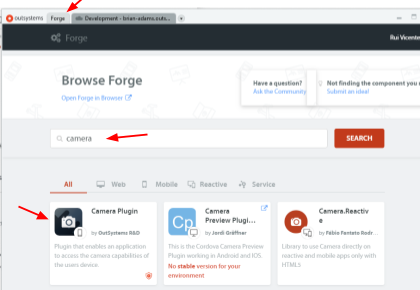

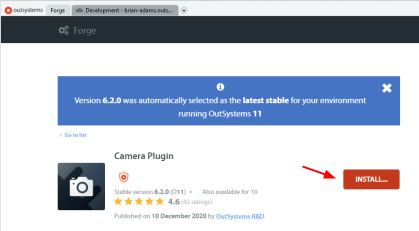

You should see some apps being installed. Do not worry if the app disappears at the end, you may have an option not to show supported applications enabled.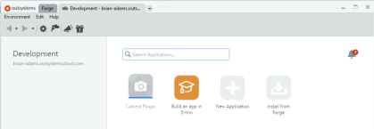

The next one is Image Utils Reactive

Again you should see the installation taking place.

OutStagram Files
----------------

Download the following files:

*   [Logo](https://www.google.com/url?q=https://drive.google.com/uc?export%3Ddownload%26id%3D1jcmbelENtEdVvpy9muCFTV88W67tOQZX&sa=D&source=editors&ust=1652709690873622&usg=AOvVaw0eivbDwMXGZwpr9hpSAkPZ)
*   [Application](https://www.google.com/url?q=https://drive.google.com/uc?export%3Ddownload%26id%3D1XG_lZLkIrNVlJdA1wZ7QHG0KY5eKGXO0&sa=D&source=editors&ust=1652709690874085&usg=AOvVaw1M-fd6QwKFi_-SLH7pOgUz)

Install OutStagram
------------------

On Studio menu, select Environment and Open Files

Flip the type to OutSystems Application Pack and select OutStagram.OAP

 And proceed with the installation.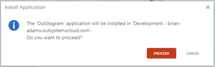

In the end you should have something similar to…

Create the application
----------------------

In OutSystems, we can start developing apps from predefined templates. Templates can contain screen layout definitions, CSS, and other logic and data. Templates encourage the reuse of important components and can help create a consistent look and feel across multiple apps.

*   Create an App

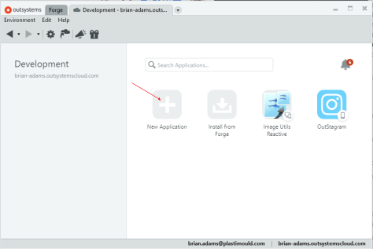

*   Start from scratch

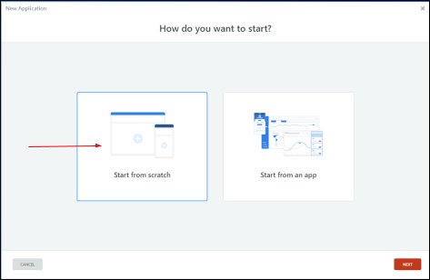

*   Select Phone App

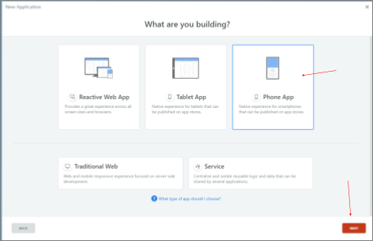

*   Give a name to the application
*   Upload the logo

*   Create Module

You should see something similar to this

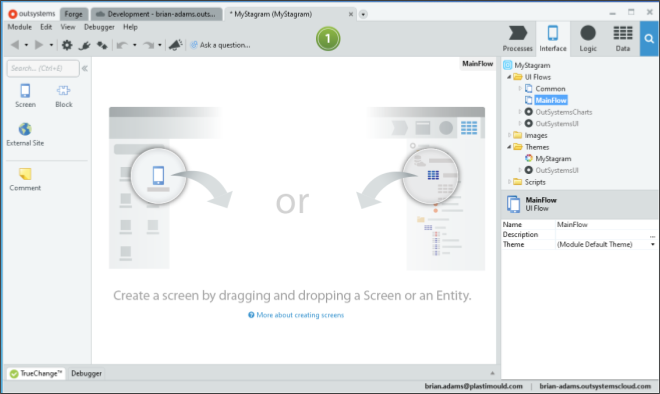

Reference OutStagram Core
-------------------------

We will be needing some pre-made methods that exist on the OutStagram core module.

Click the manage dependencies icon 

Search and select Image\_Utils\_Reactive and check the box for the Resize method.

Repeat the process and search and select the CameraPlugin and select the TakePicture method.

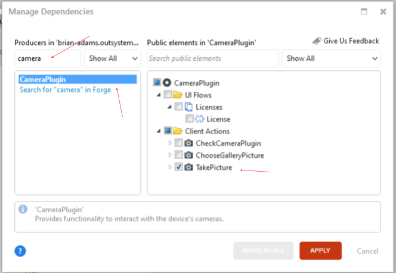

Repeat the process and search and select the OutStagramCore and then check all the boxes, including the server actions and entities. Click the refresh all button (if enabled) and then the apply button.

Go ahead and publish the application for the first time using the one click publish button.

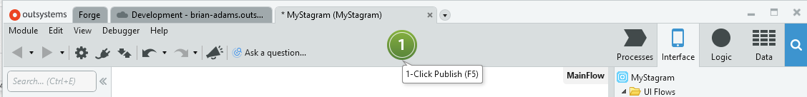

Give it a few seconds to finish. When done you should see a similar screen to  this:

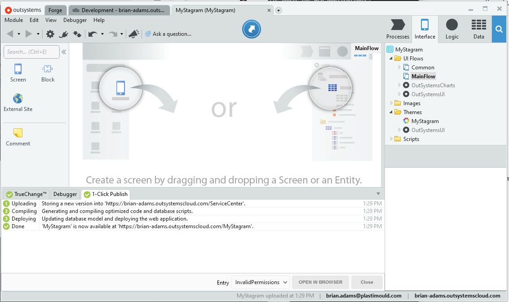

Creating the Home screen
------------------------

Drag and drop an empty screen to the Main Flow

And then select empty screen and call it Home and press create screen

The screen already has some structure to it, this is due to the standard empty template and you can always design your own.

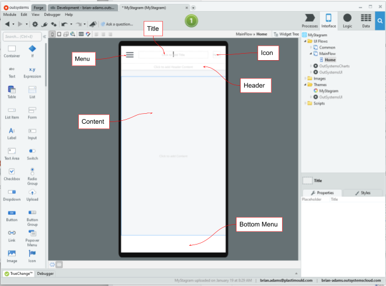

Now let's add some data to the screen. Flip to the data tab, expand OutStagramCore and drag and drop the post entity to the content area.

The platform tries to understand what you are trying to do. In this case when dragging an entity to a screen is interpreted as if you want to display that data so an accelerator kicks in and does several things for you, all of which you could do step by step manually.

*   Created a query to grab the data from the Post entity

*   

*   Created a pagination so that all the data is not loaded at the same time

*     

*   Created a list widget to support the data iteration

*   

*   Created a list item with the single item content

*   

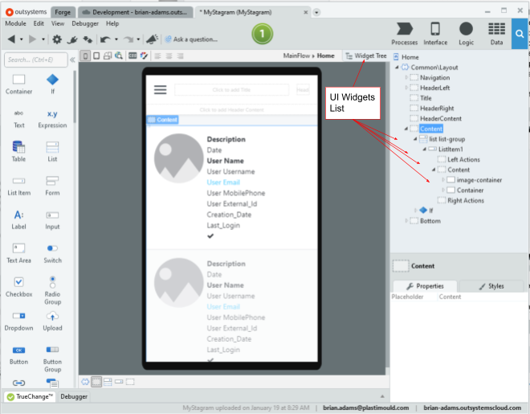

### Arranging the data display

Select the image, select the container around it and expand to the full width of the screen.

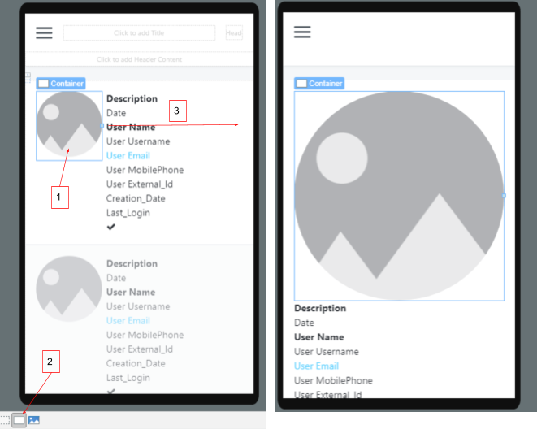

Then select the image again and delete the style class.

Delete all attributes from the screen except Description, Date and User Name and re-order them to show User Name, Description and Date. Also remove the bold classes from Description

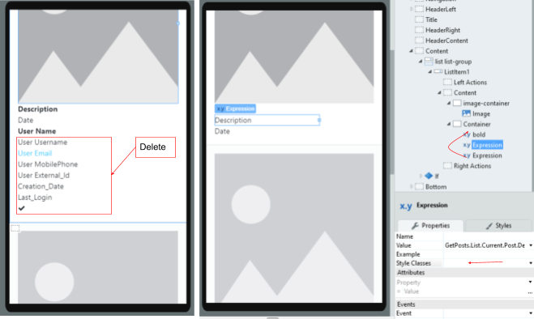

### Sort the data

We want to see the latest posts first so let's sort the data. If you do not see the GetPosts query  flip the view back from the widget tree 

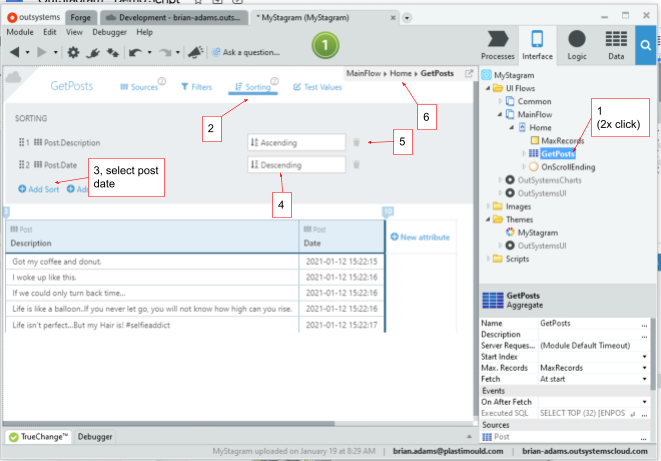

### Publish the app

You should be ready to publish the application. Put a nice title on your screen and click the big green One Click Publish button.

The publishing process consists of several steps.

It sends your code to the server and does the appropriate check in, it generates and compiles standard code from your visual model and finally it deploys the application to your server making it available for use.

### Testing the Application

You can now test your application in a few different ways.

Using your desktop browser, just click the big blue button  which will open a browser with a frame simulating your phone form factor.

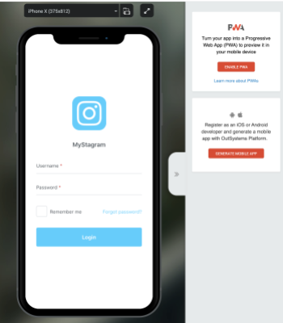

The other option is to test the application on your phone as a [PWA](https://www.google.com/url?q=https://en.wikipedia.org/wiki/Progressive_web_application&sa=D&source=editors&ust=1652709690880891&usg=AOvVaw2JFNxELbQtvjBT_pM1-ON7) (Progressive Web App). In order to do so we need to configure it.

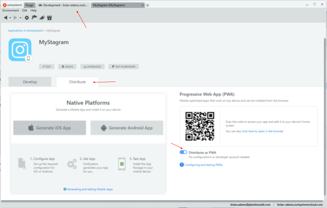

Now you just need to scan that QR Code or click the open in browser link and type the url on your phone.

A third option is to generate a native [cordova application](https://www.google.com/url?q=https://en.wikipedia.org/wiki/Apache_Cordova&sa=D&source=editors&ust=1652709690881338&usg=AOvVaw2wOyIYNxq-67IdFNrH1RMT). This will allow you to download an IPK or IPA (Android/IOS package) which can be installed on your phone or sent to the app stores for distribution.

If you have an Android phone, go ahead and click the  and then the generate app button. A few minutes later you should get another QR Code that will allow you to download and install the App to your Android phone. Depending on your phone security settings you may need to trust yourself as an application publisher.

If you have an IOS phone, Apple makes things a bit more complicated. You will need:

*   An Apple Developer License
*   To choose your build type
*   Generate you publisher certificate according to your profile
*   Generate a provisioning profile for your app

If you want to know more about publishing OutSystems applications for IOS, take a look at the [documentation](https://www.google.com/url?q=https://success.outsystems.com/Documentation/11/Delivering_Mobile_Apps/Generate_and_Distribute_Your_Mobile_App/Generate_and_Distribute_Your_Mobile_App_for_Development_Tests&sa=D&source=editors&ust=1652709690882171&usg=AOvVaw1tKaKC68Sh--zoigo9_ao3).

Finally whatever method you choose, you'll be presented with a login screen. You can login using your community email and password, or you can use one of the test users created for this application (their password is outsystems):

*   roz
*   mike\_wazowski
*   James\_sullivan

* * *

You should see something similar to this.

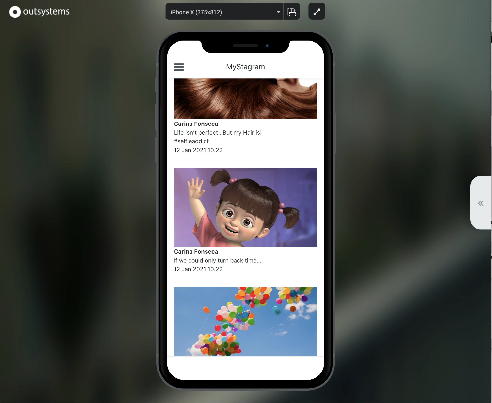

* * *

Refining the Home Screen
------------------------

### Implementing a like status

Every social media app needs a like button. In our example we'll use a heart to allow the user to like and give a visual representation.

Flip to the widget tree, expand content, list, list-item, content  and drag and drop an if right between the image-container and the other Container.

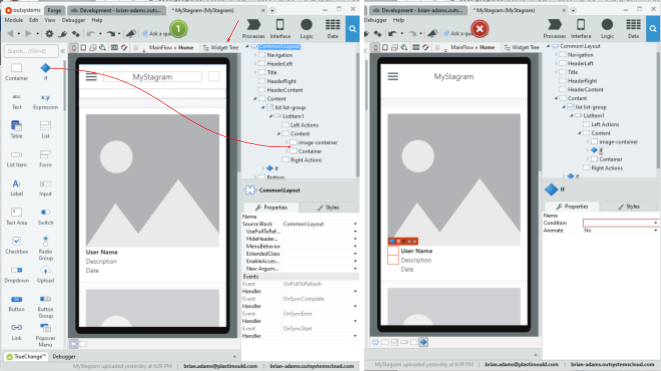

An if is a visual widget that displays the upper square if the condition is true and the lower one if false.

Next search the widgets for icon and drag it into the upper square of the if.

Repeat the process for the lower if square, but this time select an empty heart.

And of course we need a red heart, not a blck one. So select the full heart and choose a nice red color. The style editor is a quick way to change the style of an element. However you can define classes using pure CSS.

Now we need to collect the information for the likes from the database. Our initial data fetch is only returning the posts, we also need to get the likes for each post. So go ahead, flip the widget tree  and double click the  query.

Then flip to the sources, click the add source and select PostLike.

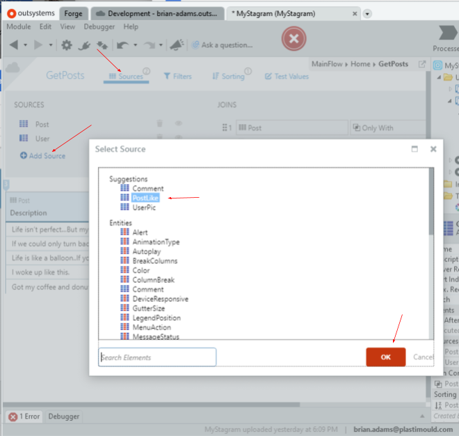

Now let's take a look at how the entities relate to each other.

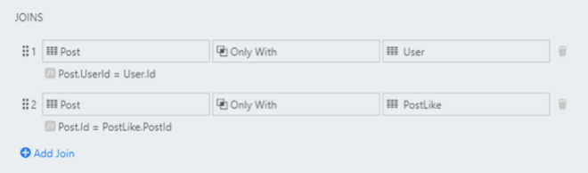

All posts Only With users and posts Only With likes. But this is not what we want…

We want all posts  Only With users and posts With or Without likes. And beyond that if a post does have a like then show me only my likes.

So flip the join type to With or Without and double click the expression to type the missing condition "and PostLike.UserId = GetUserId() ".

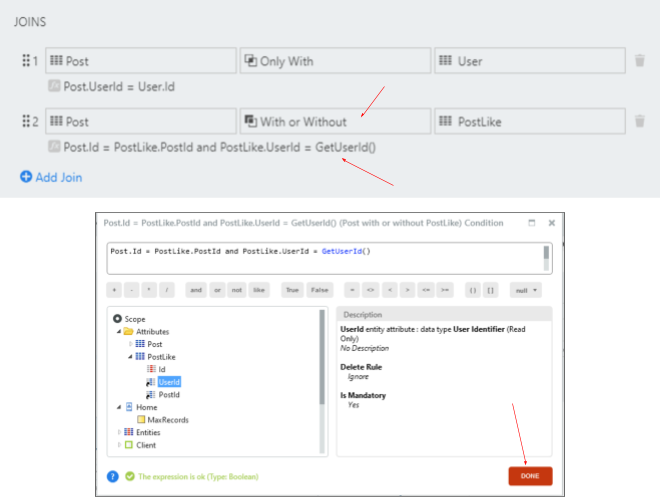

When you're done go back to the home screen by either clicking the  or double clicking the 

Finally select the if and set the condition to " GetPosts.List.Current.PostLike.Id <> NullIdentifier() ".

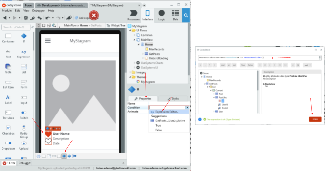

You should be able to publish your application by using the 

### Implementing the like button

Now let's implement the code necessary to accept the user input when either hearts are pressed. Right click the home screen and select add client action and rename your action to LikeOnClick. Create a new input parameter by right clicking on the LikeOnClick (), name it PostID and make sure the parameter type is Post Identifier.

Now flip to the logic tab, locate the ToggleLike action and drag it to the line of your flow below the start. Fill in the parameters for UserId and PostId.

Next grab a refresh widget, drop it on the line below the ToggleLike and select the GetPosts query.

Now go back to the Home screen, right click the if and link it to the LikeOnClick action. Fill in the PostID property with " GetPosts.List.Current.Post.Id ".

 

Go ahead publish the app  and then click the test button . You can now interact with the heart by clicking on it.

* * *

Implementing a Like counter
---------------------------

We also want to have the total number of likes for each post. For this feature we'll use a slightly different technique by introducing blocks. In OutSystems blocks are pieces of UI that can be reused multiple times on many screens.

### Creating the Block

Double click the , drop a block next to the home screen, rename it to Likes and open it with double click.

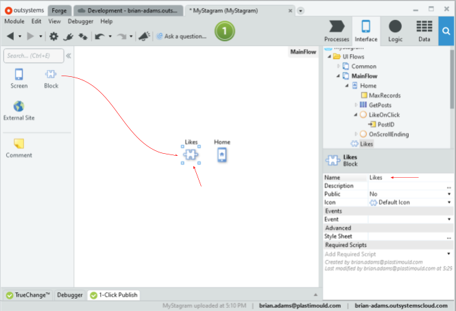

Then add a new parameter named PostID and make sure it is of type Post Identifier.

Next let's grab from the database the number of likes for a particular post. Right click on the Likes block and select Fetch Data from Database.

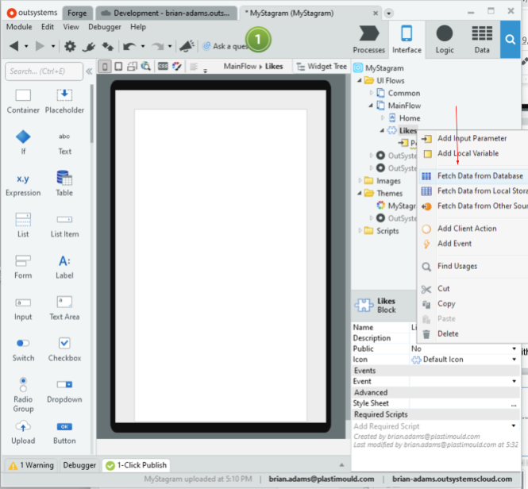

Now, click on the screen and select the PostLike entity.

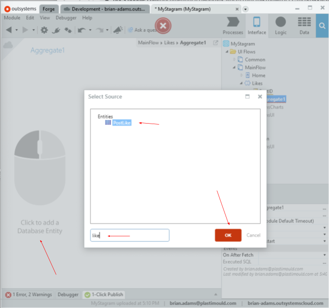

Now, we filter the likes for the PostID passed through the parameter.

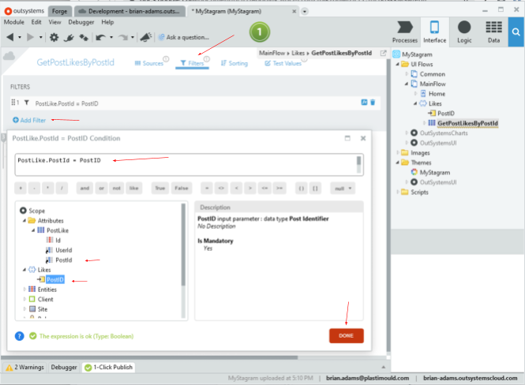

### Displaying the Like count

Back to the Like block, grab an expression and select the count under the query.

Change the example to 99 and type " likes" using the keyboard next to the expression.

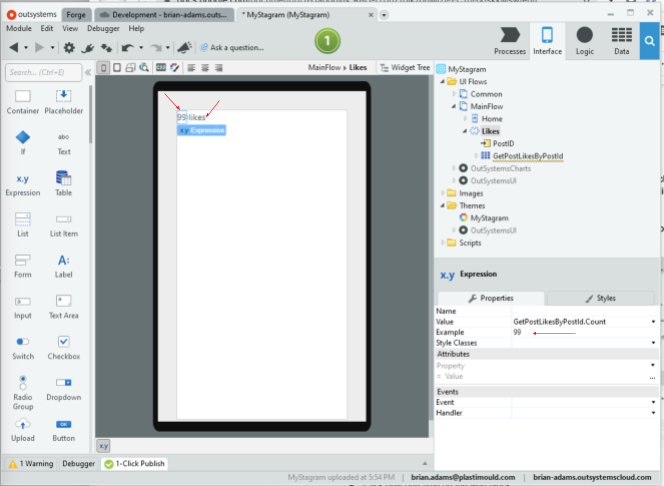

Select the expression and add 10px of left margin from the styles tab.

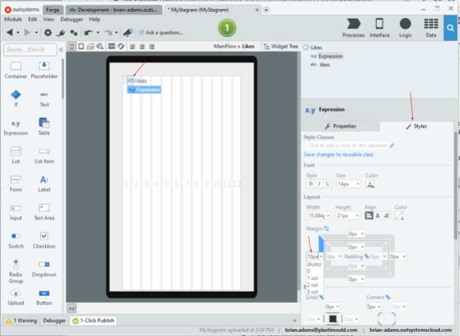

### Using the block on the Home screen

On the home screen we need to adjust the UI to make room for the likes counter. Flip to the widget tree, locate the container below the link, flip to the styles and set the width to Fill.

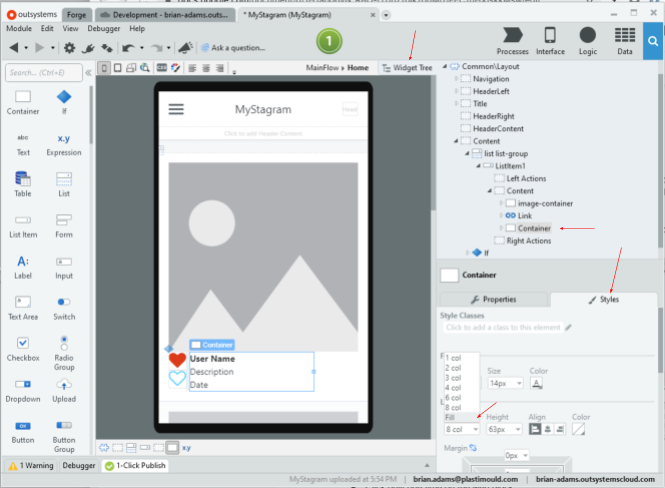

The next step is to flip back the widget tree, grab the like block, drop it next to the heart and fill in the PostID parameter.

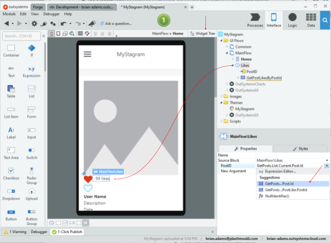

Go ahead publish the app  and then click the test button . You can now interact with the heart by clicking on it and should see the counter being updated.

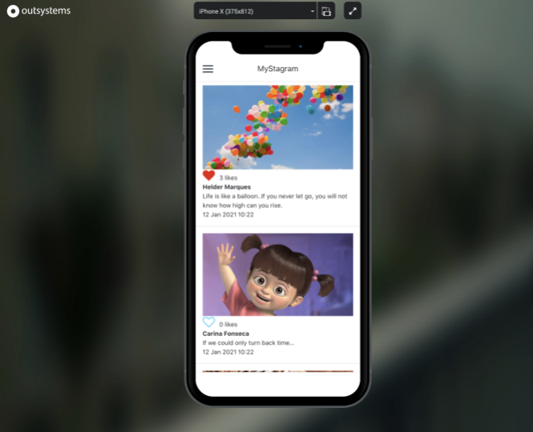

Creating a new post
-------------------

The next step is to make a screen where the user can create a new post, taking a picture and typing some content.

### Taking a picture

Navigate back to the  and drag a new screen into the canvas.

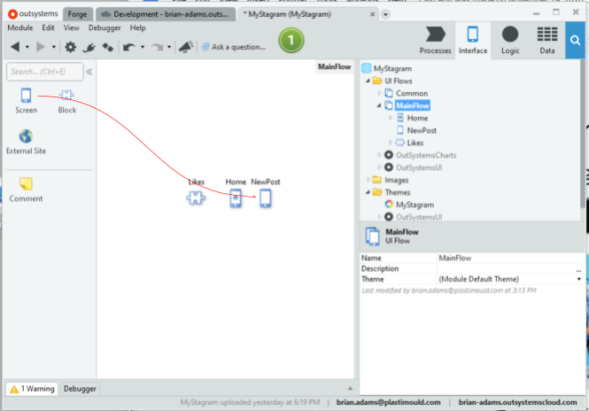

Select the empty template and name the screen NewPost.

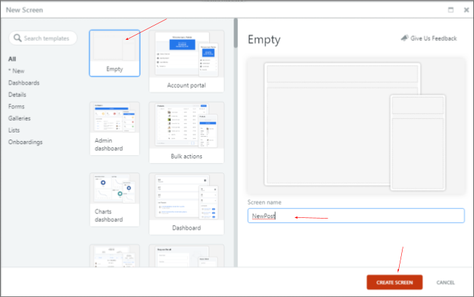

Fill in the title and drag a new icon to the upper left placeholder. Choose the camera icon.

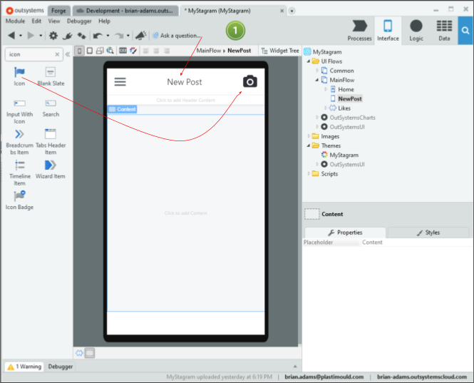

Right click on the camera icon and choose new client action.

Rename the action to CaptureImage and double click it to open the code. Also create 2 new local variables. Picture with type Binary Data and Description with type Text.

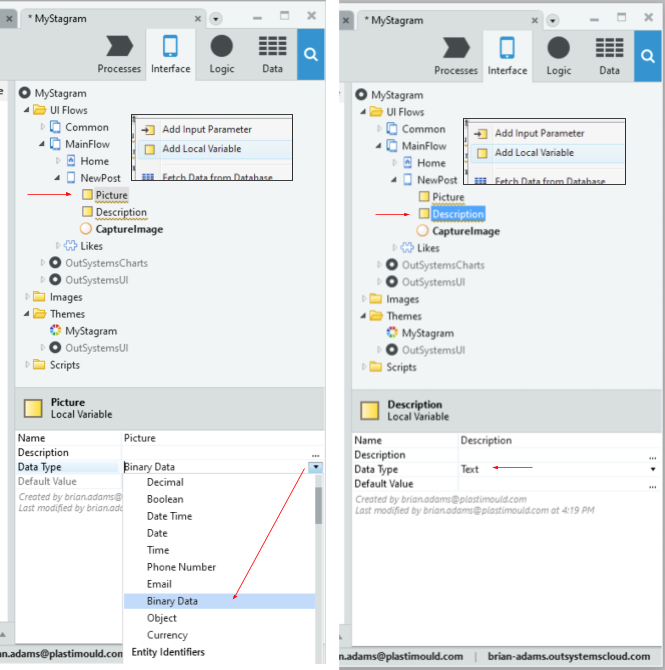

Now let's implement the logic to take a picture and store it.

Flip to the logic tab and grab the TakePicture action dropping it into the flow. While you're at it grab an If and drop it below the TakePicture. Aslo swap the if connectors with right click, so that the true branch continues down. On the If condition select TakePicture.Success.

Next, drop a message next to the If and link a false branch from it. Drop an End below the message and link from it. Select the Message and choose TakePicture.Error.Message.

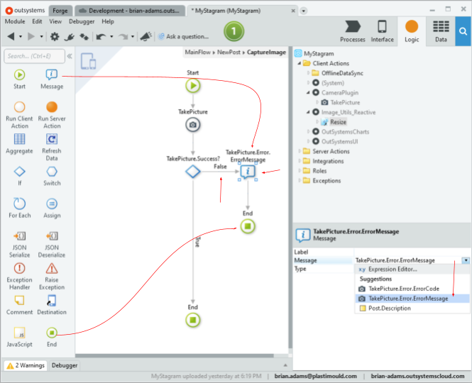

Now we are going to reduce the picture size to save some bandwidth.

Drag the Resize action below the If into the true branch. On the image parameter select TakePicture.ImageCaptured and on the MaxWidthOrHeight set it to 800.

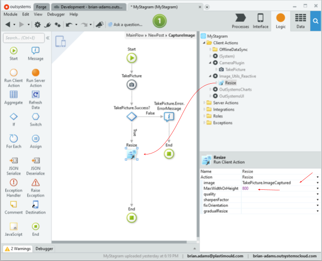

Finally let's assign the resized image to the local variable picture.

Go ahead publish the app  

### Creating the UI

Navigate back to the NewPost screen by double clicking 

Locate the Form, Image and TextArea widgets and drop it on the screen. Set the Image property type to Binary Data and the Image Content property to Picture.

Set the TextArea property Variable to Description

We also need some buttons to save or cancel the post.

Drag a container below the text area, then drag 2 buttons inside the container.

Change the buttons name to Post and Cancel and make the post button bigger in length.

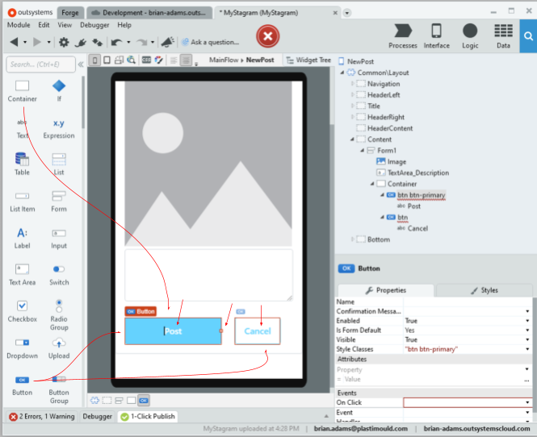

Select the Cancel button and set its On Click property to MainFlow\\home

Select the Post Button and set its On Click property to New Client Action.

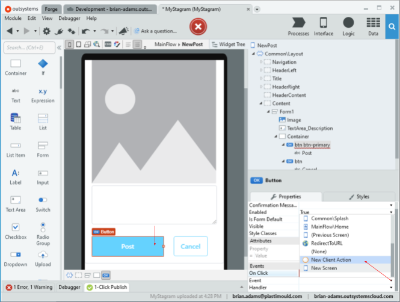

### Saving the post to the database.

Flip to the logic tab and locate the NewPost action under Server Actions/OutStagramCore and drop it below the If. On the properties set the UserId to GetUserId(), Picture to Picture and Description to Description.

Drag a Destination widget on top of the End node and choose Main Flow/Home as the destination property.

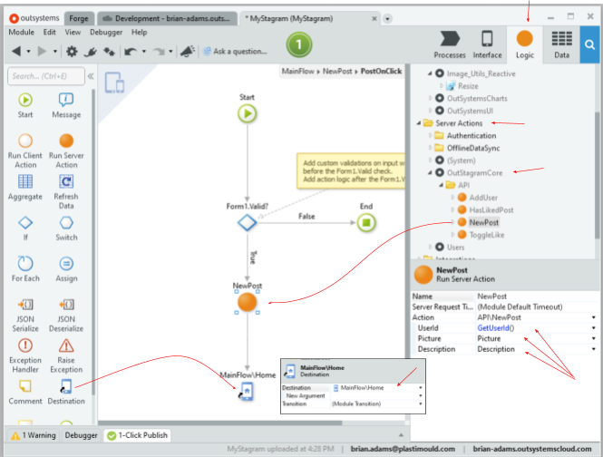

### Linking the New Post Screen

All we need to do now is to have a way for the user to access the new post screen from the home screen.

Navigate to the Home screen and drop an icon on the top left placeholder. Choose the plus sign as the image. Also right click on the icon and choose Link to, MainFlow\\NewPost.

Go ahead publish the app  

Testing the app
---------------

Because of the camera it is best to test the app on a mobile phone and because this is a PWA application you can use it without any installation.

Navigate to the main tab, switch to the distribute tab and scan the progressive web app QR Code. Or just type the URL directly on your phone.

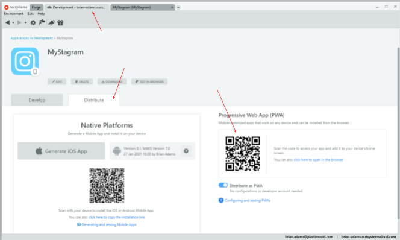

### Testing on the desktop browser

You can still test on your desktop browser. The experience will be a bit different since the browser will ask you for a file when you try to take a picture.

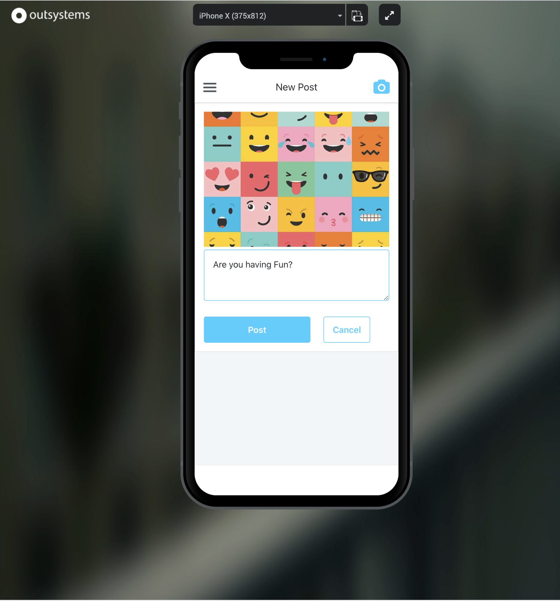

What's Next?
============

This was a slightly simplified version of the exercise and you can check out the full version at the OutStagram application.

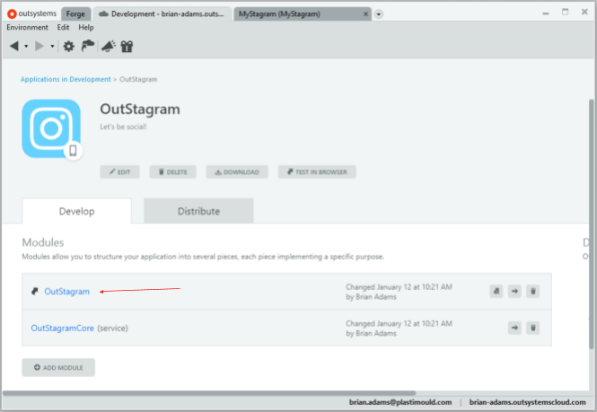

 

Check out the differences and implement them on your app.

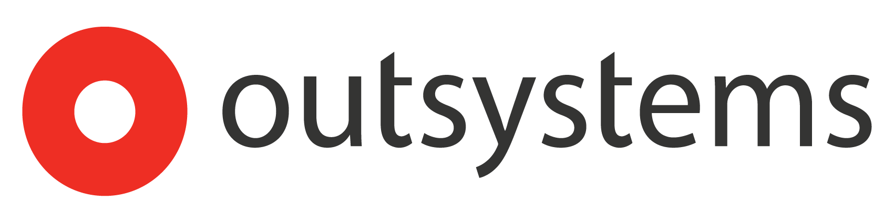
